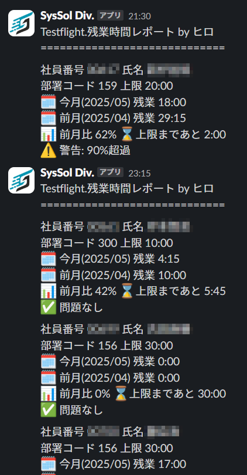

# 🚨 Division Overtime Notifier（部署別残業通知）

 King of Time API から従業員の残業情報を取得し、部署ごとの閾値や個人の状況に応じて Slack 通知を自動で行う Python ベースのスクリプトです。定期実行により、管理者および従業員自身への残業警告を効率化します。

---

## ✅ 主な機能

- 🔁 **King of Time API 連携**：対象月・前月の残業時間を取得
- 📊 **部署ごとの残業上限チェック**：設定値と比較し、警告/注意を判定
- 📣 **Slack 通知機能**：
  - 部署責任者へ：閾値を超過した社員のレポートを送信
  - 本人通知（オプション）：社員個人の Slack DM に状況レポート送信  
    - `ENABLE_SELF_NOTIFY=true` のとき有効  
    - `.env` の `SELF_NOTIFY_ENABLED_CODES` で社員番号を指定可能（カンマ区切り）
- 🔒 **閾値フラグ管理**：60%, 70%, 80%, 90%, 100% の段階で通知履歴を記録し、重複送信を防止
- 🗓️ **強制通知モード**：毎週金曜21:30（または任意指定）に残業状況に関係なく全員に通知
- 🧾 **通知履歴 / 実行ログの保存**：Slack通知履歴と実行ログをファイルに記録
- ⚙️ **`.env` による柔軟な設定管理**

---

## 💼 Slack Botの事前準備

このスクリプトを使用するには、Slack App の作成と以下のスコープが必要です。https://api.slack.com/lang/ja-jp

### 📌 必須スコープ
- `chat:write`（メッセージ送信）
- `users:read.email`（メールアドレスからユーザー特定）
- `users:read`（ユーザー情報取得）

Slack Bot Token（`xoxb-...`）を `.env` に設定してください。



---

## 📂 ディレクトリ構成（一部抜粋）

```
.
├── division_compare_overtime.py       # メインスクリプト
├── slack_notifier.py                  # Slack通知処理
├── notification_utils.py              # 通知条件の判定など
├── log_utils.py                       # ログ出力補助
├── overtime_result_saver.py           # JSON保存処理
├── employeeKey.csv                    # 社員データCSV（Git管理対象外）
├── .env                               # 本番用設定ファイル（Git管理対象外）
├── .env.sample                        # 環境変数サンプル
├── employeeKey.sample.csv             # 社員データサンプル
├── log/
│   ├── overtime_runner.log            # 実行処理ログ
│   └── notify_history.log             # Slack通知履歴
├── cache/
│   └── overtime_result_YYYYMM.json    # 月次分析結果の保存
```

---

## ⚙️ 使用手順

### ① `.env` を作成（初回のみ）
```bash
cp .env.sample .env
vi .env  # APIトークン・Slackトークンなどを設定
```

### ② 仮想環境を作成し、依存ライブラリをインストール
```bash
python -m venv .venv
source .venv/bin/activate
pip install -r requirements.txt
```

### ③ 手動実行
```bash
python division_compare_overtime.py
```

### ④ cron による定期実行設定（例）

ℹ️KING OF TIME WebAPI利用禁止時間帯について

以下の時間帯（JST）はアクセストークン、打刻登録以外のAPIの利用ができません。
- 8:30～10:00
- 17:30～18:30

詳細は https://developer.kingoftime.jp/ を確認してください。

```cron
# 平日10:30に残業比率チェック通知（閾値判定）
30 10 * * 1-5 /path/to/.venv/bin/python /path/to/division_compare_overtime.py

# 金曜21:30に強制通知（全員対象）
30 21 * * 5 /path/to/.venv/bin/python /path/to/division_compare_overtime.py
```

---

## 📄 環境変数（.env）について

`.env.sample` を参考に設定を行ってください。主な変数は以下の通りです：

- `KINGOFTIME_TOKEN`, `SLACK_BOT_TOKEN`
- `OVERTIME_TARGET_DIVISION`, `OVERTIME_TARGET_DEFAULT`
- `FORCE_NOTIFY_DAY`, `FORCE_NOTIFY_HOUR`, `FORCE_NOTIFY_MINUTE`, `FORCE_NOTIFY_WINDOW`
- `ENABLE_SELF_NOTIFY=true` にすると本人にも通知が送信されます
- `SELF_NOTIFY_ENABLED_CODES=12345,67890`  
   本人通知の対象社員番号をカンマ区切りで指定。空の場合は全員通知対象となりません。

---

## 🔐 セキュリティとGit運用

- `.env`, `employeeKey.csv` は **.gitignore によりGit管理外** にしてください
- サンプル（`.env.sample`, `employeeKey.sample.csv`）を使ってリポジトリ構築・共有が可能です

---

このリポジトリにより、手間なく確実に残業状況を把握し、Slack上でタイムリーに通知を行うことが可能になります 💬📈
